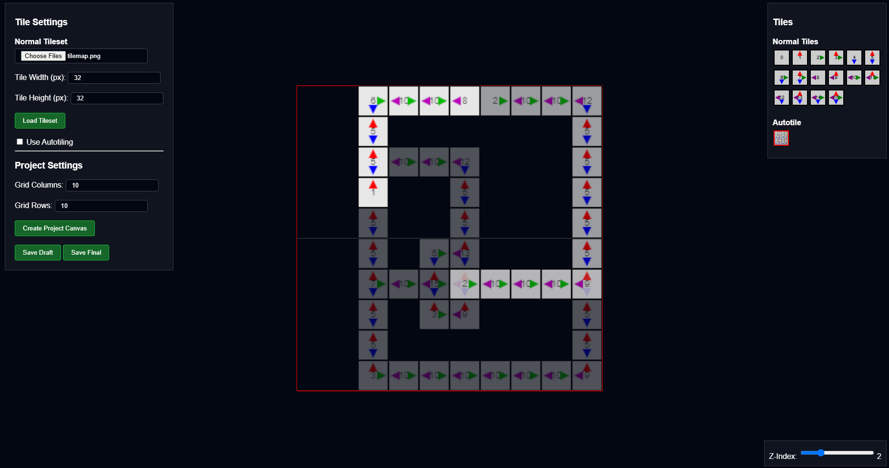

# Payung Tile Editor

<i>Current state</i>

---

a simple tile editor. To be integrated with Payung engine later on for Visual Novel and RPGM type game.

---

## Features

- **Tileset Loading & Slicing:**  
  Load a tileset image and automatically slice it into individual tiles based on user-defined dimensions. Supports two modes:  
  - **Normal Tiles:** Slices the image into multiple smaller canvases.  
  - **Autotiles:** Uses a single tile image that updates its variant based on neighboring tiles.

- **Grid-Based Placement:**  
  Create a project with a customizable grid (columns, rows, tile width, and height). Tiles are snapped to grid positions and checked for placement boundaries.

- **Interactive Tile Placement:**  
  - **Preview:** Hovering over the grid shows a semi-transparent preview of the selected tile.  
  - **Placement & Removal:** Click to place a tile; clicking an already occupied cell removes the tile.
  - **Rotation:** Press the `R` key to rotate the preview tile by 90° increments.

- **Layer Management:**  
  Utilize a z-index slider to manage multiple layers, adjusting tile visibility and opacity based on the active layer.

- **Autotile Functionality:**  
  For autotiles, the script dynamically calculates a bitmask based on adjacent tiles and updates the tile's texture variant to create seamless transitions.

- **Export Functionality:**  
  Export the final arrangement as separate PNG images for each layer, packaged into a ZIP file.
